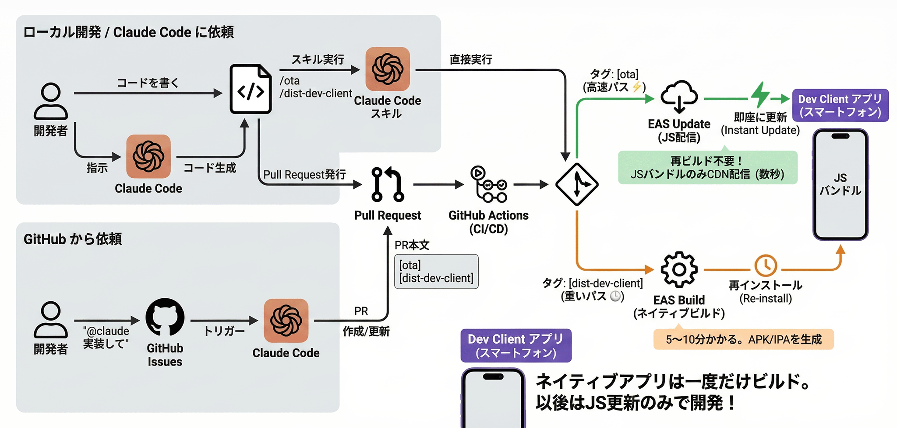

# expo-template

Expo + EAS Update + Claude Code による効率的なモバイルアプリ開発テンプレート

## このテンプレートでできること

- **Expo Go**: Android/Appleの開発者アカウント不要のの簡易開発
- **Dev Client**: カスタムネイティブモジュールを使った本格開発
- **EAS Update (OTA)**: JS変更を再ビルドなしで即座に配信
- **GitHub Actions**: PR マージで自動デプロイ
- **Claude Code スキル**: `/ota`, `/dist-dev-client` で簡単デプロイ
- **GitHub から Claude 呼び出し**: Issue/PR に `@claude` でメンション、自動実装

## アーキテクチャ

- **Dev Client**(Expo Go): ネイティブアプリを一度ビルド（実行環境）
- **EAS Update**: JS バンドルを OTA 配信（再ビルド不要で更新）
- **GitHub Actions**: タグベース自動デプロイ（`[ota]` / `[dist-dev-client]`）



## クイックスタート

### 1. テンプレートから新規リポジトリ作成

https://github.com/new?template_name=expo-template&template_owner=masuidrive

### 2. 環境構築

リポジトリを clone して Claude Code で以下を実行：

```
@docs/setup-expo.md を読んで環境構築して
```

### 3. 開発開始

環境構築後は [DEVELOPERS_GUIDE.md](./DEVELOPERS_GUIDE.md) を参照して開発を進めてください。

## ドキュメント

- **[DEVELOPERS_GUIDE.md](./DEVELOPERS_GUIDE.md)** - 開発時リファレンス（スキルコマンド、PR ルール、FAQ）
- **[docs/setup-expo.md](./docs/setup-expo.md)** - 初回環境構築（AI 向け）
- **[docs/setup-gh-actions.md](./docs/setup-gh-actions.md)** - GitHub Actions 設定

## ライセンス

Apache 2.0
